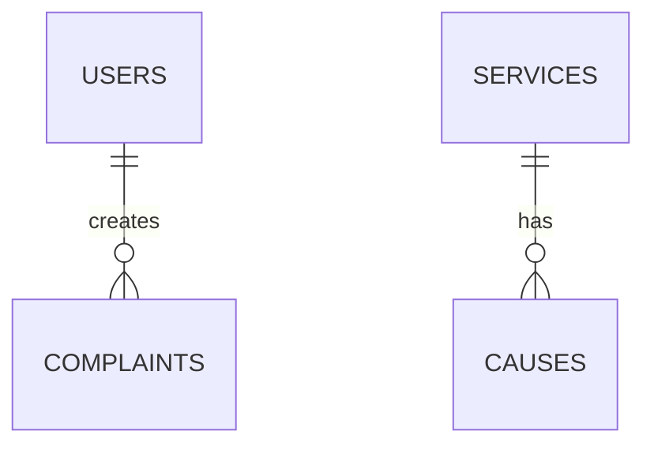
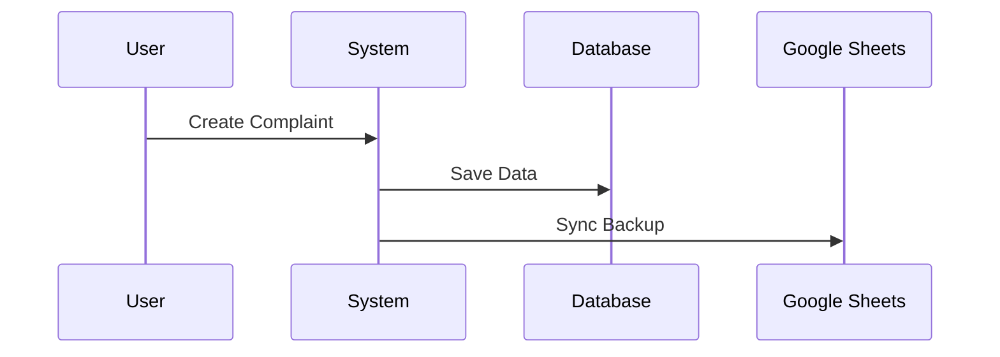
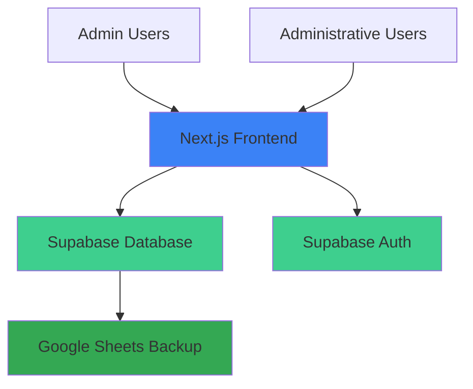

# Documentation Index

Welcome to the Complaint Management System documentation. This index provides quick access to all technical documentation and guides.

## Quick Links

- [Main README](../README.md) — Project overview, setup, and getting started
- [Core Functions Overview](core_functionality.md) — Feature specifications and workflows
- [Database Reference](database.md) — Schema, ERD, SQL scripts, and RLS policies
- [Authentication Guide](authentication.md) — OAuth, RBAC, and security implementation
- [UI Specifications](ui_specifications.md) — Page layouts, components, and design system
- [Google Sheets Integration](google_sheets_integration.md) — Backup system and Apps Script

## Documentation by Topic

### Getting Started

1. **[Main README](../README.md)** — Start here for project setup and quick start
2. **[Database Reference](database.md)** — Set up the database schema
3. **[Authentication Guide](authentication.md)** — Configure authentication

### Feature Documentation

- **[Core Functions Overview](core_functionality.md)**
  - Authentication system
  - Complaint management
  - Service configuration
  - User management
  - Data synchronization

### Technical Reference

- **[Database Reference](database.md)**
  - Entity relationship diagram
  - Table specifications
  - SQL scripts
  - Row-level security policies
  - Triggers and functions

- **[Authentication Guide](authentication.md)**
  - OAuth configuration
  - Role-based access control
  - Protected routes
  - Session management
  - Security best practices

### Design and UI

- **[UI Specifications](ui_specifications.md)**
  - Page layouts and mockups
  - Component specifications
  - Design system
  - Responsive breakpoints
  - Accessibility guidelines

### Integration Guides

- **[Google Sheets Integration](google_sheets_integration.md)**
  - Architecture overview
  - Apps Script implementation
  - Setup instructions
  - Troubleshooting

## Documentation Standards

### File Organization

All documentation files are written in Markdown and organized in the `/docs` directory:

```
docs/
├── README.md                        # This index file
├── core_functionality.md            # Feature specifications
├── database.md                      # Database schema and design
├── authentication.md                # Auth and security
├── ui_specifications.md             # UI/UX guidelines
└── google_sheets_integration.md     # Backup integration
```

### Writing Guidelines

When contributing to documentation:

1. **Use clear headings** — Organize content with H2 and H3 headings
2. **Include code examples** — Show implementation examples in relevant sections
3. **Add diagrams** — Use Mermaid for architecture and flow diagrams
4. **Keep it updated** — Update docs when making code changes
5. **Link between docs** — Cross-reference related documentation

### Mermaid Diagrams

We use [Mermaid](https://mermaid.js.org/) for diagrams. Examples:

**Entity Relationship Diagram**:



**Sequence Diagram**:



## Architecture Overview

### System Components



### Technology Stack

- **Frontend**: Next.js 14 (App Router), React, TypeScript
- **Styling**: Tailwind CSS, shadcn/ui components
- **Database**: Supabase (PostgreSQL)
- **Authentication**: Supabase Auth (OAuth)
- **Hosting**: Vercel
- **Backup**: Google Sheets + Apps Script
- **CDN**: Cloudflare

### User Roles

| Role               | Permissions                                                |
| ------------------ | ---------------------------------------------------------- |
| **Admin**          | Full system access, user management, service configuration |
| **Administrative** | Create/view complaints, read-only access to services       |

## Common Tasks

### Creating a New Feature

1. Review [Core Functions Overview](core_functionality.md)
2. Check [Database Reference](database.md) for schema changes
3. Update [UI Specifications](ui_specifications.md) for new pages
4. Implement with proper TypeScript types
5. Add tests for new functionality
6. Update documentation

### Modifying the Database

1. Review current schema in [Database Reference](database.md)
2. Create migration SQL
3. Test in development environment
4. Update ERD and documentation
5. Apply to production

### Adding a New Page

1. Check [UI Specifications](ui_specifications.md) for design
2. Create page in appropriate App Router directory
3. Implement with proper authentication
4. Add to navigation if needed
5. Update this documentation

## API Documentation

For detailed API endpoint specifications, refer to:

- API routes in `/app/api/*`
- Supabase client usage in `/lib/supabase/*`
- Type definitions in `/types/*`

### Common API Patterns

**Fetching complaints**:

```typescript
const { data, error } = await supabase
  .from("complaints")
  .select("*, services(*), causes(*), users(*)")
  .order("created_at", { ascending: false });
```

**Creating a complaint**:

```typescript
const { data, error } = await supabase.from("complaints").insert({
  complainant_name: "John Doe",
  service_id: 1,
  // ... other fields
});
```

## Troubleshooting

### Common Issues

**Database connection errors**:

- Verify Supabase credentials in `.env.local`
- Check RLS policies are correctly configured
- Ensure user has proper authentication

**Authentication issues**:

- Check Supabase Auth configuration
- Verify user role is set correctly
- Review middleware configuration

**Google Sheets sync not working**:

- Verify Apps Script is deployed
- Check Supabase API credentials in script
- Review execution logs in Apps Script

## Contributing to Documentation

We welcome documentation improvements! To contribute:

1. Fork the repository
2. Make your changes to the relevant `.md` file
3. Ensure links and code examples are accurate
4. Submit a pull request with description of changes

## Version History

- **v1.0** (Initial) — Core documentation created
  - Project setup and structure
  - Database schema and migrations
  - Authentication and authorization
  - UI specifications
  - Google Sheets integration

## Support

For questions about the documentation:

- Create an issue in the repository
- Contact the development team
- Check existing documentation for answers

## Additional Resources

- [Next.js Documentation](https://nextjs.org/docs)
- [Supabase Documentation](https://supabase.com/docs)
- [Tailwind CSS Documentation](https://tailwindcss.com/docs)
- [shadcn/ui Components](https://ui.shadcn.com)
- [TypeScript Handbook](https://www.typescriptlang.org/docs/)
