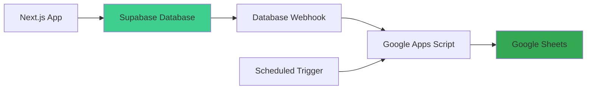

# Google Sheets Integration

## Overview

The system maintains a real-time backup of all complaints in a Google Sheet. This serves as a contingency plan in case of database issues and provides an easy-to-use interface for stakeholders who prefer spreadsheets.

## Integration Architecture



## Implementation Options

### Option 1: Supabase Database Webhooks (Recommended)

**Pros**:

- Real-time updates
- Automatic on every insert/update
- No manual scheduling needed

**Cons**:

- Requires webhook endpoint
- More complex setup

**Implementation**:

```sql
-- Create a webhook function in Supabase
CREATE OR REPLACE FUNCTION notify_complaint_change()
RETURNS TRIGGER AS $$
BEGIN
  PERFORM net.http_post(
    url := 'YOUR_APPS_SCRIPT_URL',
    headers := '{"Content-Type": "application/json"}'::jsonb,
    body := json_build_object(
      'operation', TG_OP,
      'complaint_id', NEW.id,
      'complaint_number', NEW.complaint_number,
      'data', row_to_json(NEW)
    )::text
  );
  RETURN NEW;
END;
$$ LANGUAGE plpgsql;

-- Create triggers
CREATE TRIGGER on_complaint_insert
  AFTER INSERT ON complaints
  FOR EACH ROW
  EXECUTE FUNCTION notify_complaint_change();

CREATE TRIGGER on_complaint_update
  AFTER UPDATE ON complaints
  FOR EACH ROW
  EXECUTE FUNCTION notify_complaint_change();
```

### Option 2: Scheduled Google Apps Script (Simpler)

**Pros**:

- Easier to set up
- No webhook needed
- Can batch updates

**Cons**:

- Not real-time (15 min delay)
- Requires Supabase API access

**Implementation**: See below

## Google Sheets Structure

### Sheet 1: Reclamos (Complaints)

Columns:

1. Número de Reclamo
2. Fecha de Reclamo
3. Nombre y Apellido
4. Dirección
5. Número
6. DNI
7. Teléfono
8. Email
9. Servicio
10. Causa
11. Zona
12. Desde Cuándo
13. Medio de Contacto
14. Detalle
15. Estado
16. Derivado
17. Responsable de Carga
18. Fecha de Carga (Sistema)
19. Última Modificación (Sistema)

### Sheet 2: Servicios

Columns:

1. ID
2. Nombre del Servicio
3. Causas (Lista separada por comas)

### Sheet 3: Usuarios

Columns:

1. Nombre y Apellido
2. Email
3. Rol
4. Fecha de Alta

## Google Apps Script Implementation

### Script Setup

1. Open Google Sheets
2. Extensions > Apps Script
3. Create new project: "Complaint Sync"
4. Add the following files

### Code.gs (Main Script)

```javascript
// Configuration
const SUPABASE_URL = "YOUR_SUPABASE_URL";
const SUPABASE_KEY = "YOUR_SUPABASE_ANON_KEY";

// Sheet names
const COMPLAINTS_SHEET = "Reclamos";
const SERVICES_SHEET = "Servicios";
const USERS_SHEET = "Usuarios";

/**
 * Main sync function - runs on schedule
 */
function syncComplaintsToSheet() {
  try {
    Logger.log("Starting complaint sync...");

    const complaints = fetchComplaintsFromSupabase();
    const sheet = getOrCreateSheet(COMPLAINTS_SHEET);

    updateComplaintsSheet(sheet, complaints);

    Logger.log(`Successfully synced ${complaints.length} complaints`);
  } catch (error) {
    Logger.log("Error syncing complaints: " + error.message);
    sendErrorNotification(error);
  }
}

/**
 * Fetch complaints from Supabase with related data
 */
function fetchComplaintsFromSupabase() {
  const url = `${SUPABASE_URL}/rest/v1/complaint_details?select=*&order=id.desc`;

  const options = {
    method: "get",
    headers: {
      apikey: SUPABASE_KEY,
      Authorization: `Bearer ${SUPABASE_KEY}`,
      "Content-Type": "application/json",
    },
  };

  const response = UrlFetchApp.fetch(url, options);
  const data = JSON.parse(response.getContentText());

  return data;
}

/**
 * Update complaints sheet with data
 */
function updateComplaintsSheet(sheet, complaints) {
  // Clear existing data (except header)
  const lastRow = sheet.getLastRow();
  if (lastRow > 1) {
    sheet.getRange(2, 1, lastRow - 1, sheet.getLastColumn()).clear();
  }

  // Set headers if first run
  if (sheet.getLastRow() === 0) {
    const headers = [
      "Número de Reclamo",
      "Fecha de Reclamo",
      "Nombre y Apellido",
      "Dirección",
      "Número",
      "DNI",
      "Teléfono",
      "Email",
      "Servicio",
      "Causa",
      "Zona",
      "Desde Cuándo",
      "Medio de Contacto",
      "Detalle",
      "Estado",
      "Derivado",
      "Responsable de Carga",
      "Fecha de Carga",
      "Última Modificación",
    ];
    sheet.getRange(1, 1, 1, headers.length).setValues([headers]);
    sheet.getRange(1, 1, 1, headers.length).setFontWeight("bold");
    sheet.setFrozenRows(1);
  }

  // Prepare data rows
  const rows = complaints.map((complaint) => [
    complaint.complaint_number,
    formatDate(complaint.complaint_date),
    complaint.complainant_name,
    complaint.address,
    complaint.street_number,
    complaint.dni || "",
    complaint.phone_number || "",
    complaint.email || "",
    complaint.service_name,
    complaint.cause_name,
    complaint.zone,
    formatDate(complaint.since_when),
    complaint.contact_method,
    complaint.details,
    complaint.status,
    complaint.referred ? "Sí" : "No",
    complaint.loaded_by_name,
    formatDateTime(complaint.created_at),
    formatDateTime(complaint.updated_at),
  ]);

  // Write data
  if (rows.length > 0) {
    sheet.getRange(2, 1, rows.length, rows[0].length).setValues(rows);

    // Auto-resize columns
    for (let i = 1; i <= rows[0].length; i++) {
      sheet.autoResizeColumn(i);
    }

    // Apply alternating row colors
    sheet
      .getRange(2, 1, rows.length, rows[0].length)
      .applyRowBanding(SpreadsheetApp.BandingTheme.LIGHT_GREY);
  }
}

/**
 * Get or create sheet
 */
function getOrCreateSheet(sheetName) {
  const ss = SpreadsheetApp.getActiveSpreadsheet();
  let sheet = ss.getSheetByName(sheetName);

  if (!sheet) {
    sheet = ss.insertSheet(sheetName);
  }

  return sheet;
}

/**
 * Format date to DD/MM/YYYY
 */
function formatDate(dateString) {
  if (!dateString) return "";

  const date = new Date(dateString);
  const day = String(date.getDate()).padStart(2, "0");
  const month = String(date.getMonth() + 1).padStart(2, "0");
  const year = date.getFullYear();

  return `${day}/${month}/${year}`;
}

/**
 * Format datetime to DD/MM/YYYY HH:MM
 */
function formatDateTime(dateString) {
  if (!dateString) return "";

  const date = new Date(dateString);
  const day = String(date.getDate()).padStart(2, "0");
  const month = String(date.getMonth() + 1).padStart(2, "0");
  const year = date.getFullYear();
  const hours = String(date.getHours()).padStart(2, "0");
  const minutes = String(date.getMinutes()).padStart(2, "0");

  return `${day}/${month}/${year} ${hours}:${minutes}`;
}

/**
 * Send error notification
 */
function sendErrorNotification(error) {
  // Configure email notification for errors
  const recipient = "admin@example.com";
  const subject = "Error en sincronización de reclamos";
  const body = `Se produjo un error al sincronizar los reclamos:\n\n${error.message}\n\nStack trace:\n${error.stack}`;

  MailApp.sendEmail(recipient, subject, body);
}

/**
 * Webhook handler for real-time updates (Option 1)
 */
function doPost(e) {
  try {
    const data = JSON.parse(e.postData.contents);

    Logger.log("Received webhook: " + JSON.stringify(data));

    // Handle the update
    if (data.operation === "INSERT" || data.operation === "UPDATE") {
      syncSingleComplaint(data.complaint_id);
    }

    return ContentService.createTextOutput(
      JSON.stringify({
        status: "success",
      }),
    ).setMimeType(ContentService.MimeType.JSON);
  } catch (error) {
    Logger.log("Error processing webhook: " + error.message);

    return ContentService.createTextOutput(
      JSON.stringify({
        status: "error",
        message: error.message,
      }),
    ).setMimeType(ContentService.MimeType.JSON);
  }
}

/**
 * Sync a single complaint (for webhook updates)
 */
function syncSingleComplaint(complaintId) {
  const url = `${SUPABASE_URL}/rest/v1/complaint_details?id=eq.${complaintId}&select=*`;

  const options = {
    method: "get",
    headers: {
      apikey: SUPABASE_KEY,
      Authorization: `Bearer ${SUPABASE_KEY}`,
      "Content-Type": "application/json",
    },
  };

  const response = UrlFetchApp.fetch(url, options);
  const data = JSON.parse(response.getContentText());

  if (data.length > 0) {
    const complaint = data[0];
    const sheet = getOrCreateSheet(COMPLAINTS_SHEET);

    // Find row with this complaint number
    const complaintNumbers = sheet
      .getRange(2, 1, sheet.getLastRow() - 1, 1)
      .getValues();
    const rowIndex = complaintNumbers.findIndex(
      (row) => row[0] === complaint.complaint_number,
    );

    if (rowIndex >= 0) {
      // Update existing row
      const actualRow = rowIndex + 2; // +2 because array is 0-indexed and we skip header
      updateComplaintRow(sheet, actualRow, complaint);
    } else {
      // Add new row
      addComplaintRow(sheet, complaint);
    }
  }
}

/**
 * Update a specific complaint row
 */
function updateComplaintRow(sheet, row, complaint) {
  const values = [
    [
      complaint.complaint_number,
      formatDate(complaint.complaint_date),
      complaint.complainant_name,
      complaint.address,
      complaint.street_number,
      complaint.dni || "",
      complaint.phone_number || "",
      complaint.email || "",
      complaint.service_name,
      complaint.cause_name,
      complaint.zone,
      formatDate(complaint.since_when),
      complaint.contact_method,
      complaint.details,
      complaint.status,
      complaint.referred ? "Sí" : "No",
      complaint.loaded_by_name,
      formatDateTime(complaint.created_at),
      formatDateTime(complaint.updated_at),
    ],
  ];

  sheet.getRange(row, 1, 1, values[0].length).setValues(values);
}

/**
 * Add new complaint row
 */
function addComplaintRow(sheet, complaint) {
  const lastRow = sheet.getLastRow();
  updateComplaintRow(sheet, lastRow + 1, complaint);
}

/**
 * Sync services to sheet
 */
function syncServicesToSheet() {
  try {
    const services = fetchServicesFromSupabase();
    const sheet = getOrCreateSheet(SERVICES_SHEET);

    updateServicesSheet(sheet, services);

    Logger.log(`Successfully synced ${services.length} services`);
  } catch (error) {
    Logger.log("Error syncing services: " + error.message);
  }
}

/**
 * Fetch services with causes from Supabase
 */
function fetchServicesFromSupabase() {
  const url = `${SUPABASE_URL}/rest/v1/services?select=*,causes(name)&order=id`;

  const options = {
    method: "get",
    headers: {
      apikey: SUPABASE_KEY,
      Authorization: `Bearer ${SUPABASE_KEY}`,
      "Content-Type": "application/json",
    },
  };

  const response = UrlFetchApp.fetch(url, options);
  return JSON.parse(response.getContentText());
}

/**
 * Update services sheet
 */
function updateServicesSheet(sheet, services) {
  // Clear and set headers
  sheet.clear();
  const headers = ["ID", "Servicio", "Causas"];
  sheet.getRange(1, 1, 1, headers.length).setValues([headers]);
  sheet.getRange(1, 1, 1, headers.length).setFontWeight("bold");

  // Prepare rows
  const rows = services.map((service) => [
    service.id,
    service.name,
    service.causes.map((c) => c.name).join(", "),
  ]);

  if (rows.length > 0) {
    sheet.getRange(2, 1, rows.length, rows[0].length).setValues(rows);
    sheet.autoResizeColumns(1, headers.length);
  }
}
```

### Triggers.gs (Scheduled Triggers)

```javascript
/**
 * Set up time-based triggers
 * Run this once manually to create the triggers
 */
function setupTriggers() {
  // Delete existing triggers
  const triggers = ScriptApp.getProjectTriggers();
  triggers.forEach((trigger) => ScriptApp.deleteTrigger(trigger));

  // Sync complaints every 15 minutes
  ScriptApp.newTrigger("syncComplaintsToSheet")
    .timeBased()
    .everyMinutes(15)
    .create();

  // Sync services every hour
  ScriptApp.newTrigger("syncServicesToSheet")
    .timeBased()
    .everyHours(1)
    .create();

  Logger.log("Triggers created successfully");
}

/**
 * Remove all triggers
 */
function removeTriggers() {
  const triggers = ScriptApp.getProjectTriggers();
  triggers.forEach((trigger) => ScriptApp.deleteTrigger(trigger));

  Logger.log("All triggers removed");
}
```

## Setup Instructions

### 1. Create Google Sheet

1. Create a new Google Sheet
2. Name it "Sistema de Reclamos - Backup"
3. Share with appropriate users (read-only)

### 2. Configure Apps Script

1. Open the sheet
2. Extensions > Apps Script
3. Copy the code above
4. Replace `SUPABASE_URL` and `SUPABASE_KEY` with your credentials
5. Save the project

### 3. Set Up Scheduled Sync

1. Run `setupTriggers()` function once manually
2. Authorize the script when prompted
3. Verify triggers in Triggers tab

### 4. Deploy as Web App (for webhooks)

1. Click "Deploy" > "New deployment"
2. Select "Web app" type
3. Execute as: Me
4. Who has access: Anyone
5. Copy the web app URL
6. Use this URL in Supabase webhook configuration

### 5. Test the Integration

1. Create a complaint in the web application
2. Wait 15 minutes or run `syncComplaintsToSheet()` manually
3. Verify data appears in Google Sheet

## Security Considerations

1. **API Keys**: Store Supabase keys in Script Properties (not in code)

   ```javascript
   const scriptProperties = PropertiesService.getScriptProperties();
   const SUPABASE_KEY = scriptProperties.getProperty("SUPABASE_KEY");
   ```

2. **Sheet Permissions**:
   - Script editor: Only admins
   - Sheet view: Read-only for all users
   - No edit permissions via sheet

3. **Error Handling**:
   - All functions wrapped in try-catch
   - Email notifications on errors
   - Logging for debugging

## Monitoring and Maintenance

### Check Sync Status

Create a monitoring sheet with last sync time:

```javascript
function updateSyncStatus() {
  const sheet = getOrCreateSheet("_SyncStatus");
  const now = new Date();

  sheet.getRange("A1").setValue("Last Sync:");
  sheet.getRange("B1").setValue(now);
}
```

### Manual Sync Button

Add a custom menu for manual syncing:

```javascript
function onOpen() {
  const ui = SpreadsheetApp.getUi();
  ui.createMenu("Sincronización")
    .addItem("Sincronizar Reclamos", "syncComplaintsToSheet")
    .addItem("Sincronizar Servicios", "syncServicesToSheet")
    .addSeparator()
    .addItem("Ver Estado", "showSyncStatus")
    .addToUi();
}

function showSyncStatus() {
  const ui = SpreadsheetApp.getUi();
  const lastRun = ScriptApp.getProjectTriggers()[0]
    .getTriggerSource()
    .getLastUpdated();

  ui.alert(
    "Estado de Sincronización",
    `Última ejecución: ${lastRun}`,
    ui.ButtonSet.OK,
  );
}
```

## Troubleshooting

### Sync Not Working

1. Check Apps Script execution logs
2. Verify Supabase credentials
3. Check trigger configuration
4. Test API endpoint manually

### Duplicate Entries

- Increase sync frequency
- Check for trigger conflicts
- Verify unique constraint on complaint_number

### Performance Issues

- Reduce sync frequency for large datasets
- Implement incremental sync (only changes since last sync)
- Use batch operations for updates
